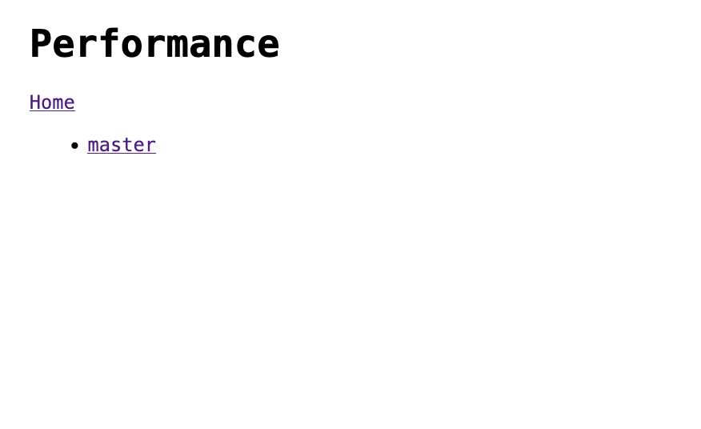
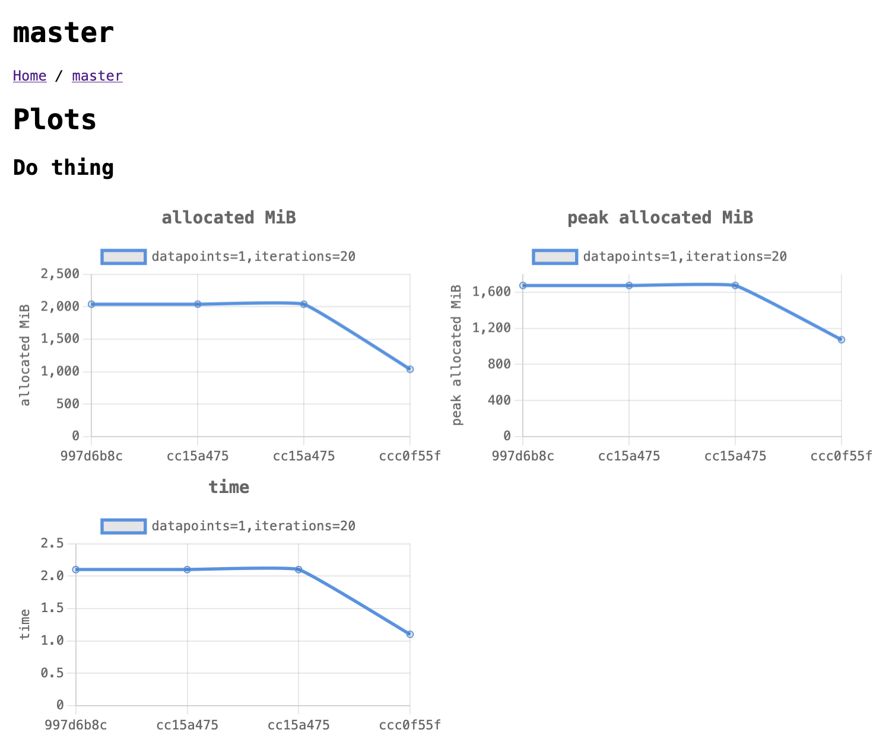
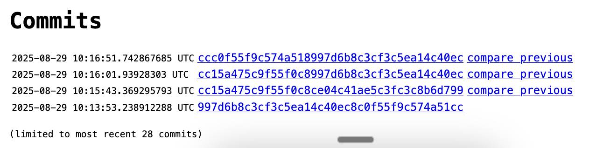
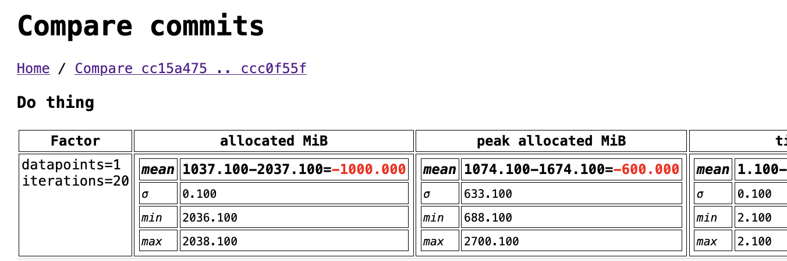

# perfly

A simple web service that records performance numbers for a software
project, split into branches and commits. Intended to be used in
tandem with CI.

## Screenshots

The pages are listed below:

| Feature         | Description                                                                 | Screenshot                                              |
|-----------------|-----------------------------------------------------------------------------|---------------------------------------------------------|
| Branch list     | Populated as CI sends results to it.                                        |          |
| Branch charts   | On a given branch, it will chart the results over time.                     |      |
| Commit list     | You can see the last 28 commits (configurable via `?limit=..` query param). |          |
| Compare commits | Diff individual commits.                                                    |  |

Home page is the branch list.

## Storage

Data is stored in a simple SQLite database.

## API

The URL to send data is:
https://your-deployed-perfly/branch/$BRANCH_NAME/$COMMIT_HASH?token=<YOUR TOKEN>

## Schema

```json
{
  "$schema": "https://json-schema.org/draft/2020-12/schema",
  "title": "Commit",
  "type": "object",
  "properties": {
    "branch": {
      "type": "string",
      "description": "What branch this was on"
    },
    "commit": {
      "type": "string",
      "description": "Commit"
    },
    "result": {
      "$ref": "#/$defs/Result"
    }
  },
  "required": ["branch", "commit", "result"],
  "$defs": {
    "Result": {
      "type": "object",
      "properties": {
        "benchmarks": {
          "type": "array",
          "items": { "$ref": "#/$defs/Benchmark" }
        }
      },
      "required": ["benchmarks"]
    },
    "Benchmark": {
      "type": "object",
      "properties": {
        "subject": {
          "type": "string",
          "description": "What is being tested"
        },
        "tests": {
          "type": "array",
          "items": { "$ref": "#/$defs/Test" }
        }
      },
      "required": ["subject", "tests"]
    },
    "Test": {
      "type": "object",
      "properties": {
        "factors": {
          "type": "array",
          "items": { "$ref": "#/$defs/Factor" }
        },
        "metrics": {
          "type": "array",
          "items": { "$ref": "#/$defs/Metric" }
        }
      },
      "required": ["factors", "metrics"]
    },
    "Factor": {
      "type": "object",
      "properties": {
        "factor": {
          "type": "string",
          "description": "What aspect is being varied"
        },
        "value": {
          "type": "string",
          "description": "The value of this factor (can represent both text and numbers)"
        }
      },
      "required": ["factor", "value"]
    },
    "Metric": {
      "type": "object",
      "properties": {
        "metric": {
          "type": "string",
          "description": "Name of the metric (e.g., 'time_ms')"
        },
        "rangeLower": {
          "type": "number",
          "description": "Lower bound of the range"
        },
        "rangeUpper": {
          "type": "number",
          "description": "Upper bound of the range"
        },
        "mean": {
          "type": "number",
          "description": "Mean value"
        },
        "stddev": {
          "type": "number",
          "description": "Standard deviation"
        }
      },
      "required": ["metric", "rangeLower", "rangeUpper", "mean", "stddev"]
    }
  }
}
```

## Example

```json
{
  "branch": "master",
  "commit": "997d6b8c3cf3c5ea14c40ec8c0f55f9c574a51cc",
  "result": {
    "benchmarks": [
      {
        "subject": "create things",
        "tests": [
          {
            "factors": [
              {
                "factor": "records",
                "value": "2"
              }
            ],
            "metrics": [
              {
                "mean": 0.1,
                "metric": "time",
                "rangeLower": 0.1,
                "rangeUpper": 1.1,
                "stddev": 0.1
              },
              {
                "mean": 610.1,
                "metric": "allocated MiB",
                "rangeLower": 260.1,
                "rangeUpper": 1660.1,
                "stddev": 699.1
              },
              {
                "mean": 433.1,
                "metric": "peak allocated MiB",
                "rangeLower": 433.1,
                "rangeUpper": 433.1,
                "stddev": 0.1
              }
            ]
          },
          {
            "factors": [
              {
                "factor": "records",
                "value": "20"
              }
            ],
            "metrics": [
              {
                "mean": 4.1,
                "metric": "time",
                "rangeLower": 4.1,
                "rangeUpper": 4.1,
                "stddev": 0.1
              },
              {
                "mean": 2605.1,
                "metric": "allocated MiB",
                "rangeLower": 2604.1,
                "rangeUpper": 2606.1,
                "stddev": 0.1
              },
              {
                "mean": 471.1,
                "metric": "peak allocated MiB",
                "rangeLower": 444.1,
                "rangeUpper": 489.1,
                "stddev": 19.1
              }
            ]
          },
          {
            "factors": [
              {
                "factor": "records",
                "value": "200"
              }
            ],
            "metrics": [
              {
                "mean": 41.1,
                "metric": "time",
                "rangeLower": 41.1,
                "rangeUpper": 41.1,
                "stddev": 0.1
              },
              {
                "mean": 26074.1,
                "metric": "allocated MiB",
                "rangeLower": 26074.1,
                "rangeUpper": 26074.1,
                "stddev": 0.1
              },
              {
                "mean": 499.1,
                "metric": "peak allocated MiB",
                "rangeLower": 493.1,
                "rangeUpper": 505.1,
                "stddev": 5.1
              }
            ]
          }
        ]
      },
      {
        "subject": "Do thing",
        "tests": [
          {
            "factors": [
              {
                "factor": "iterations",
                "value": "20"
              },
              {
                "factor": "datapoints",
                "value": "1"
              }
            ],
            "metrics": [
              {
                "mean": 2.1,
                "metric": "time",
                "rangeLower": 2.1,
                "rangeUpper": 2.1,
                "stddev": 0.1
              },
              {
                "mean": 2037.1,
                "metric": "allocated MiB",
                "rangeLower": 2036.1,
                "rangeUpper": 2038.1,
                "stddev": 0.1
              },
              {
                "mean": 1674.1,
                "metric": "peak allocated MiB",
                "rangeLower": 688.1,
                "rangeUpper": 2700.1,
                "stddev": 633.1
              }
            ]
          }
        ]
      }
    ]
  }
}
```

An example request:

```
POST http://localhost:8080/hooks/update?token=apitok
Content-Type: application/json

{
  "branch": "master",
  "commit": "ccc0f55f9c574a518997d6b8c3cf3c5ea14c40ec",
  "result": {
    "benchmarks": [
    ...
```

## Deploying

Example systemd configuration. The two environment variables to
configure are `PERF_TOKEN` and `PORT`. It needs write access to the
PWD to write a `perf.sqlite3` database file.

```
[Unit]
Description=perfly
After=network.target

[Service]
Type=simple
WorkingDirectory=/home/you/perfly-repo/
ExecStart=/usr/bin/env perfly
Restart=on-failure
Environment="PATH=/home/you/.cabal/bin"
Environment="PERF_TOKEN=<your token>"
Environment="PORT=8080"

[Install]
WantedBy=multi-user.target
```
